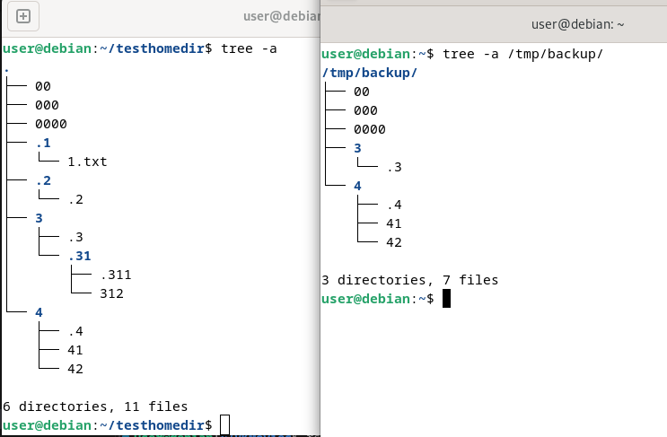
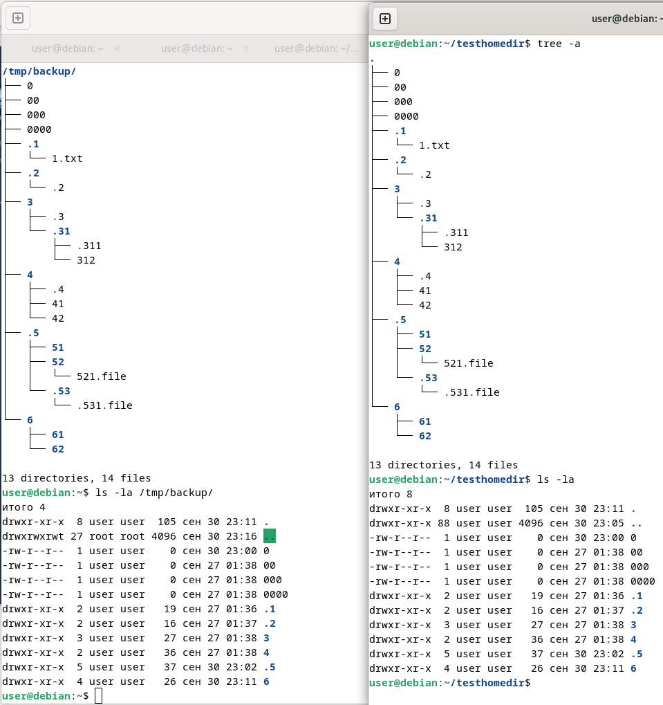
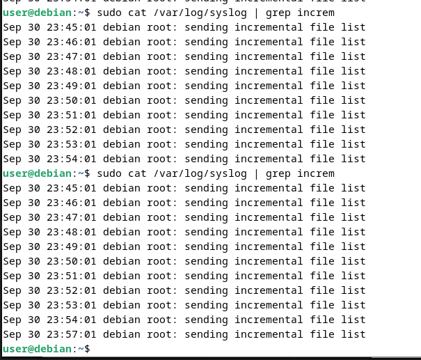

# Домашнее задание к занятию " 1 `Disaster recovery`" - `Alekseev Aleksandr`

---

### Задание 1
Составьте команду rsync, которая позволяет создавать зеркальную копию домашней директории пользователя в директорию /tmp/backup
Необходимо исключить из синхронизации все директории, начинающиеся с точки (скрытые)
Необходимо сделать так, чтобы rsync подсчитывал хэш-суммы для всех файлов, даже если их время модификации и размер идентичны в источнике и приемнике.
На проверку направить скриншот с командой и результатом ее выполнения

```bash
$ rsync -a --progress --checksum --exclude '.*/' /home/user/testhomedir/* /tmp/backup/
```



---

### Задание 2
Написать скрипт и настроить задачу на регулярное резервное копирование домашней директории пользователя с помощью rsync и cron.
Резервная копия должна быть полностью зеркальной
Резервная копия должна создаваться раз в день, в системном логе должна появляться запись об успешном или неуспешном выполнении операции
Резервная копия размещается локально, в директории /tmp/backup
На проверку направить файл crontab и скриншот с результатом работы утилиты.


#### Скрин соответствия тестового каталога пользователя и /tmp/backup/


#### Порядок команд
1. Для пользователя user в файле sudoers определим привилегии для записи в logger без требования пароля
- $ sudo visudo
- - user    ALL=(ALL:ALL) NOPASSWD: ALL

2. Формируем файл скрипта с командой синхронизации каталогов
``` bash
#!/bin/bash
sudo rsync -a --progress --checksum /home/user/testhomedir/ /tmp/backup/
```

3. Используем команду crontab -e для формирования/редактирования файла расписания для заданий пользователя user.
Укажем расписание и вызываемый скрипт с командой (или конвейером) передачи вывода в лог-файл

#### Версии Файлов crontab: 
- ежеминутный в собственный лог-файл
``` bash
*/1 * * * * ~/HW-9-Reliability/9-03-files-rsync/backupscript.sh >> ~/HW-9-Reliability/9-03-files-rsync/rsynclogs/myrsync.log 2>&1
```

- ежеминутный с записью результата в системный лог-файл
``` bash
*/1 * * * * ~/HW-9-Reliability/9-03-files-rsync/backupscript.sh 2>&1 | sudo logger
```

- один раз в сутки с записью результата в системный лог-файл 
``` bash
57 23 * * * ~/HW-9-Reliability/9-03-files-rsync/backupscript.sh 2>&1 | sudo logger
```

- Скрин записей системного лога (сначала с интервалом в 1 мин, последняя - по однократному срабатыванию в 23:57)


---

### Задание 3*
Настройте ограничение на используемую пропускную способность rsync до 1 Мбит/c
Проверьте настройку, синхронизируя большой файл между двумя серверами
На проверку направьте команду и результат ее выполнения в виде скриншота

---

### ЗЗадание 4*
Напишите скрипт, который будет производить инкрементное резервное копирование домашней директории пользователя с помощью rsync на другой сервер
Скрипт должен удалять старые резервные копии (сохранять только последние 5 штук)
Напишите скрипт управления резервными копиями, в нем можно выбрать резервную копию и данные восстановятся к состоянию на момент создания данной резервной копии.
На проверку направьте скрипт и скриншоты, демонстрирующие его работу в различных сценариях.


