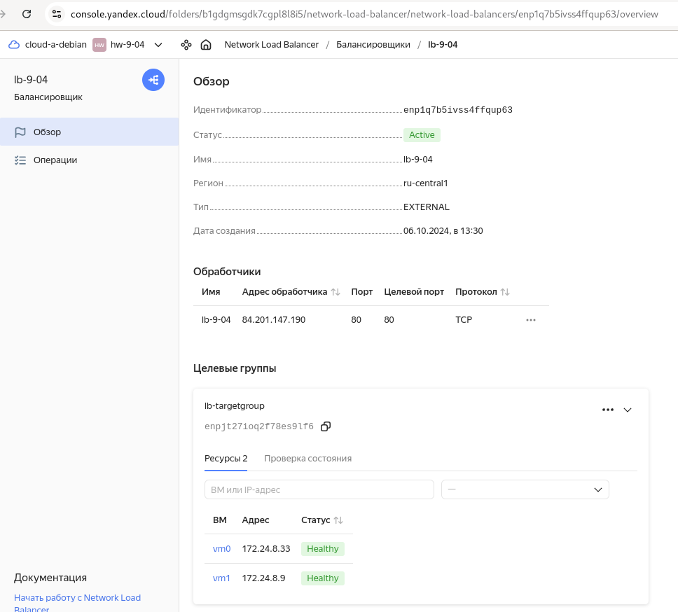
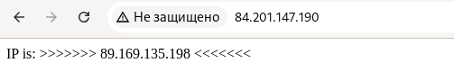

# Домашнее задание к занятию "9-04 `Отказоустойчивость в облаке`"  `Alekseev Aleksandr`

---

### Задание 1
Задание 1
Возьмите за основу решение к заданию 1 из занятия «Подъём инфраструктуры в Яндекс Облаке».

Теперь вместо одной виртуальной машины сделайте terraform playbook, который:
создаст 2 идентичные виртуальные машины. Используйте аргумент count для создания таких ресурсов;
создаст таргет-группу. Поместите в неё созданные на шаге 1 виртуальные машины;
создаст сетевой балансировщик нагрузки, который слушает на порту 80, отправляет трафик на порт 80 виртуальных машин и http healthcheck на порт 80 виртуальных машин.
Рекомендуем изучить документацию сетевого балансировщика нагрузки для того, чтобы было понятно, что вы сделали.

Установите на созданные виртуальные машины пакет Nginx любым удобным способом и запустите Nginx веб-сервер на порту 80.

Перейдите в веб-консоль Yandex Cloud и убедитесь, что:

созданный балансировщик находится в статусе Active,
обе виртуальные машины в целевой группе находятся в состоянии healthy.
Сделайте запрос на 80 порт на внешний IP-адрес балансировщика и убедитесь, что вы получаете ответ в виде дефолтной страницы Nginx.
В качестве результата пришлите:

1. Terraform Playbook.

2. Скриншот статуса балансировщика и целевой группы.

3. Скриншот страницы, которая открылась при запросе IP-адреса балансировщика.

---

### Задание 2*
1. Теперь вместо создания виртуальных машин создайте группу виртуальных машин с балансировщиком нагрузки.
https://cloud.yandex.ru/docs/compute/operations/instance-groups/create-with-balancer

2. Nginx нужно будет поставить тоже автоматизированно. Для этого вам нужно будет подложить файл установки Nginx в user-data-ключ метадаты виртуальной машины.

Пример файла установки Nginx: 
https://github.com/nar3k/yc-public-tasks/blob/master/terraform/metadata.yaml
Как подставлять файл в метадату виртуальной машины: 
https://github.com/nar3k/yc-public-tasks/blob/a6c50a5e1d82f27e6d7f3897972adb872299f14a/terraform/main.tf#L38

3. Перейдите в веб-консоль Yandex Cloud и убедитесь, что:
созданный балансировщик находится в статусе Active,
обе виртуальные машины в целевой группе находятся в состоянии healthy.

4. Сделайте запрос на 80 порт на внешний IP-адрес балансировщика и убедитесь, что вы получаете ответ в виде дефолтной страницы Nginx.

В качестве результата пришлите

1. Terraform Playbook.

2. Скриншот статуса балансировщика и целевой группы.

3. Скриншот страницы, которая открылась при запросе IP-адреса балансировщика.